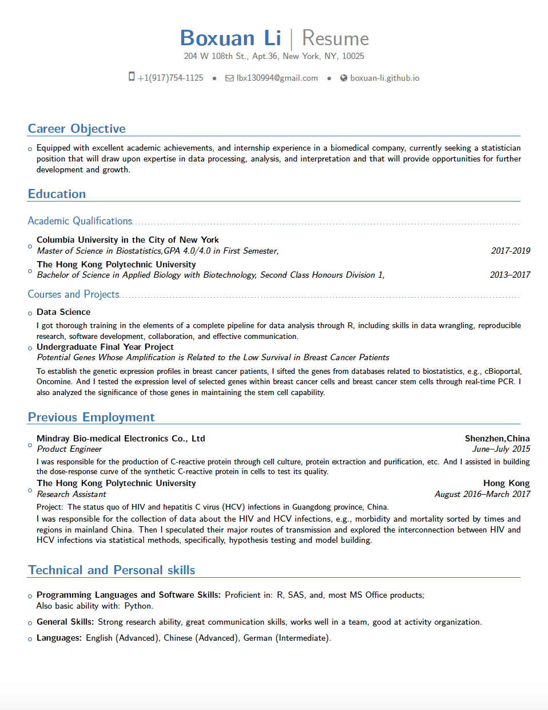

__This page includes my academic and professional experience, i.e. the resume of mine, as well as some extracurricular activities and experiences that are not incorporated in the resume.__

_Resume_

You can view or download the full document of my [resume](./resume/Resume For Job.pdf) here.

_Extracurricular experiences_

* Internal vice president of the 11th committee of the Hong Kong Polytechnic Univeristy Student's Union Chinese Mainland Students' Association. 

* Volunteer in the teaching program in No.3 High School in Jiaji, Qionghai, Hainan Province, China.

* Volunteer with Gloval Vision International (GVI) in Seychelles, recording the marine environment status by diving around the island. 

* Food and beverage associate for the summer season of 2014 in the Cedar Point Amusement Park, Ohio.

* A lot of interests, e.g. diving, photography, drum-playing, activity management, etc.